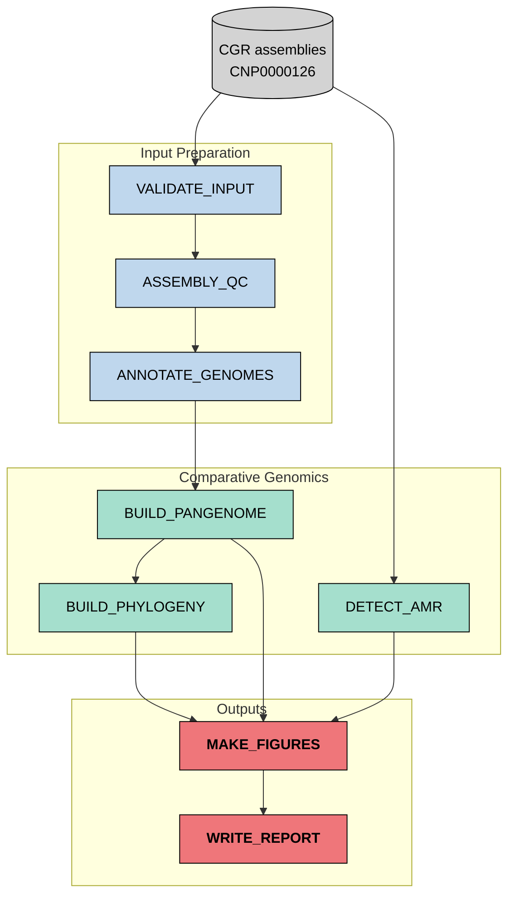
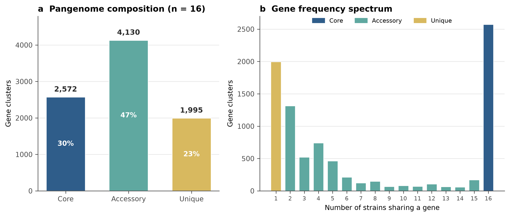
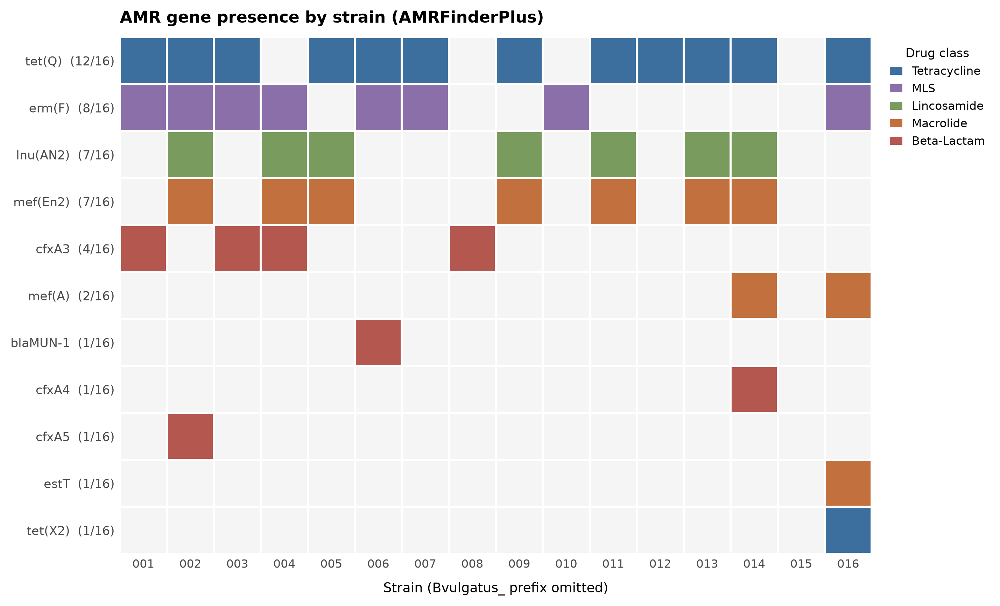
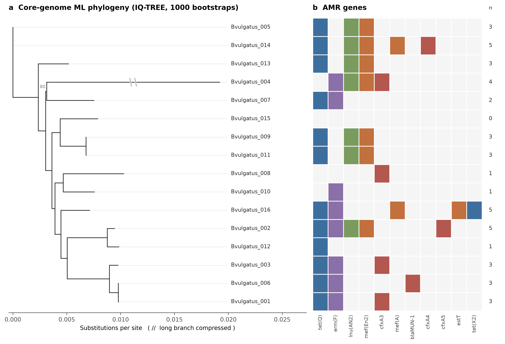

# Human-Gut-Bacterial-Pangenome-Analysis

A reproducible Nextflow pipeline for pangenome and antimicrobial-resistance profiling in *Bacteroides vulgatus*, using public reference genomes from cultivated human gut bacteria.

------------------------------------------------------------------------

## Background:

The pangenome has two parts- one is core genome and another is accessory genome. The core genome generally presents in all strains of the bacteria and it is required for essential functions .However,the accessory genome presents in some strains and often carry survival traits such as antimicrobial resistance genes. Moreover, strains of the same bacterial species do not carry the same genes. So, it is very important to know about the identification of the core genome and accessory genome of all strains in the same bacterial species.

------------------------------------------------------------------------

## Biological Questions:

1.  Which genes are conserved across strains of a single gut bacterial species, and which vary?
2.  Are antimicrobial-resistance genes part of the core genome or the accessory genome?
3.  Does resistance-gene distribution follow the core-genome phylogeny, or is it distributed differently?

------------------------------------------------------------------------

## Dataset:

| Accession | Type | Description |
|------------------------|------------------------|------------------------|
| CNP0000126 (CNGB) | Assembled genomes | Culturable Genome Reference, 1,520 draft genomes (Zou et al.) |
| PRJNA482748 (NCBI) | Assembled genomes | Same collection, NCBI mirror |

I choose this *Bacteroides vulgatus* bacteria because Zou et al. reported it has the largest pan-genome in their dataset (14,970 genes) with 66 genomes. However, I then worked on 16 genomes and analyzed those genomes due to several limitations.

------------------------------------------------------------------------

## Pipeline Overview:

This project is built as a modular Nextflow DSL2 pipeline. Each stage is a separate process with inputs and outputs; resource limits and parameters are set in `nextflow.config` and the profiles under `conf/`.

```         
gut-pangenome/
|-- README.md
|-- main.nf
|-- nextflow.config
|-- environment.yml
|-- conf
|   |-- test.config
|   `-- local.config
|-- modules
|   |-- validate_input.nf
|   |-- assembly_qc.nf
|   |-- annotate_genomes.nf
|   |-- build_pangenome.nf
|   |-- detect_amr.nf
|   |-- build_phylogeny.nf
|   |-- make_figures.nf
|   `-- write_report.nf
|-- scripts
|   |-- download_genomes.sh
|   |-- validate_and_qc.sh
|   `-- make_figures.py
|-- data
|   |-- genomes
|   `-- metadata
|       |-- samplesheet.tsv
|       `-- samplesheet_test.tsv
|-- figures
`-- results
    |-- validation
    |-- qc
    |-- annotation
    |-- panaroo
    |-- amr
    |-- phylogeny
    |-- figures
    `-- report
```

### DAG:



------------------------------------------------------------------------

## Module Outline

| Module | Tools | Description |
|------------------------|------------------------|------------------------|
| VALIDATE_INPUT | bash | It checks genome and metadata counts . It shows only one species is present. |
| ASSEMBLY_QC | seqkit | Assembly length, contig count, N50, ambiguous bases. |
| ANNOTATE_GENOMES | Prokka 1.14.6 | Gene prediction and functional annotation, identical settings for every genome. |
| BUILD_PANGENOME | Panaroo 1.5 | Gene presence or absence matrix and core-gene alignment (`--clean-mode strict`, `--core_threshold 0.98`) |
| DETECT_AMR | AMRFinderPlus 3.12.8 | Acquired resistance-gene detection from assembled nucleotide sequence. |
| BUILD_PHYLOGENY | IQ-TREE 2.3 | Maximum-likelihood core-genome tree, model selection by ModelFinder, 1000 ultrafast bootstraps |
| MAKE_FIGURES | Python, matplotlib, Biopython | Pangenome composition, AMR heatmap, tree with aligned AMR grid. |
| WRITE_REPORT | bash | Checks validation, pangenome summary and figures into a markdown report |

------------------------------------------------------------------------

## Results

### Pangenome composition:

| Category                 | Gene clusters | Share |
|--------------------------|---------------|-------|
| Core (≥98% of strains)   | 2,572         | 30%   |
| Accessory (2–15 strains) | 4,130         | 47%   |
| Unique (1 strain)        | 1,995         | 23%   |
| **Total**                | **8,697**     |       |

### Antimicrobial resistance:

There were 11 antimicrobial resistance genes detected in this analysis but those did not present in all 16 strains.

| Gene | Drug class | Strains |
|------------------------|------------------------|------------------------|
| tet(Q) | Tetracycline | 12/16 |
| erm(F) | Lincosamide/Macrolide/Streptogramin | 8/16 |
| lnu(AN2) | Lincosamide | 7/16 |
| mef(En2) | Macrolide | 7/16 |
| cfxA3 | Beta-lactam | 4/16 |
| mef(A) | Macrolide | 2/16 |
| blaMUN-1, cfxA4, cfxA5, estT, tet(X2) | Beta-lactam / Macrolide / Tetracycline | 1/16 each |

### Figures:

**Figure 1. Pangenome composition (n = 16) and gene frequency spectrum**



**Figure 2. Resistance gene presence per strain, coloured by drug class**



**Figure 3. Core-genome tree with aligned resistance gene grid**



## Setup:

``` bash
# clone the repo
git clone https://github.com/mdabrarfaiyaj/human-gut-bacterial-pangenome-analysis.git
cd human-gut-bacterial-pangenome-analysis

# create the conda environment
conda env create -f environment.yml
conda activate gut-pangenome

# AMRFinderPlus requires its database to be downloaded once
amrfinder -u

# download the 16 selected assemblies from CNGB
bash scripts/download_genomes.sh

# validate FASTA files and run assembly QC
bash scripts/validate_and_qc.sh

# smoke test on 3 genomes
nextflow run main.nf -profile test,conda

# full run on the 16-genome subset
nextflow run main.nf -profile local,conda
```

### Environment notes:

Panaroo 1.5 does not pin its dependency versions, and there were some problems that encountered on Python 3.11 version:

-   Biopython ≥1.82 rejects the FASTA formatting Panaroo that produces internally. `environment.yml` pins `biopython=1.81`.
-   `numpy.ndarray.tostring()` was removed in NumPy ≥1.23, but is still called in `panaroo/prokka.py`. Old versions of NumPy have to retain it and it has no Python 3.11 build, so the method is patched to its modern equivalent:

``` bash
sed -i 's/\.tostring()/\.tobytes()/' \
  $CONDA_PREFIX/lib/python3.11/site-packages/panaroo/prokka.py
```

------------------------------------------------------------------------

## Limitations:

-   16 of 66 available genomes, selected for assembly quality, which biases toward well-assembled strains.
-   Single species; conclusions do not extend to other gut bacteria.
-   Isolates derive from healthy Chinese donors and may not represent other populations.
-   Draft assemblies can fragment or miss genes, which inflates apparent accessory-genome content.
-   Resistance is assumed from sequence, not measured phenotypically.
-   Species identity was confirmed from the source metadata; no independent ANI check was run.

------------------------------------------------------------------------

## Status:

Complete. The pipeline runs end to end from a sample-sheet to figures and a report, with a 3-genome test profile for verification and a 16-genome local profile for the full analysis.

------------------------------------------------------------------------

## Future Directions:

-   Extend to all 66 available *B. vulgatus* genomes on a larger machine.
-   Apply the workflow to a second species for cross-species comparison of resistance-gene distribution.

------------------------------------------------------------------------

## Reference:

Zou, Y., Xue, W., Luo, G. et al. 1,520 reference genomes from cultivated human gut bacteria enable functional microbiome analyses. *Nature Biotechnology* 37, 179–185 (2019). <https://doi.org/10.1038/s41587-018-0008-8>

------------------------------------------------------------------------

## Author:

Md. Abrar Faiyaj \| M.Sc. in Biotechnology
